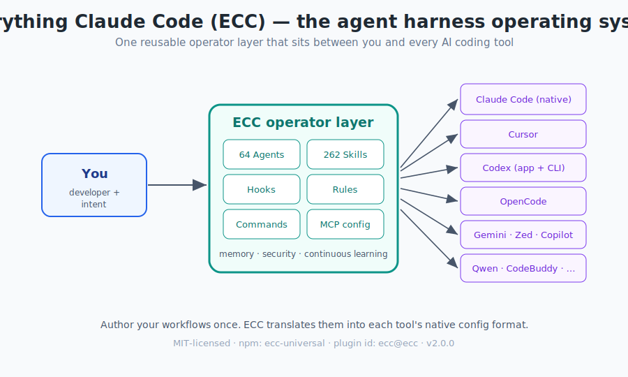

# Everything Claude Code — The Complete Field Guide

> A book-length, hands-on guide to **[affaan-m/ecc](https://github.com/affaan-m/ecc)** — *Everything Claude Code (ECC)*, the agent-harness operating system for AI-assisted software development.

This guide teaches you what ECC is, where it came from, how it is built, and — most importantly — **how to actually use it day to day**. It is written for someone who has never touched the repo before and wants to go from zero to confident operator.

  

---

## Heads-up about the name

If you searched for "ECC" expecting *Elliptic Curve Cryptography*, this is a different project. **`affaan-m/ecc` redirects to `affaan-m/everything-Claude-code`.** Throughout this book, **ECC = Everything Claude Code**. There is no cryptography here — it is a system of agents, skills, hooks, and rules that supercharge AI coding assistants.

---

## Who this book is for

- **New users** who installed ECC (or are thinking about it) and feel overwhelmed by 64 agents, 262 skills, and 84 commands.
- **Existing Claude Code / Cursor / Codex users** who want a mental model instead of a pile of config files.
- **Team leads** evaluating whether to adopt ECC and how to do it safely.
- **Anyone curious** about how a serious "agent harness" is engineered.

No prior ECC knowledge is assumed. Basic familiarity with a terminal and at least one AI coding tool (Claude Code, Cursor, Codex, etc.) is helpful.

---

## How to read this book

The chapters are ordered so each one builds on the last, but they are also self-contained enough to jump around. If you are in a hurry:

- **Just want it working?** Read Chapter 0 → Chapter 3 (Installation) → Chapter 11 (Everyday Workflows).
- **Want to understand it first?** Read Chapters 1 and 2, then dive into components.
- **Worried about safety?** Read Chapter 15 (Security) before you install anything that runs hooks.

---

## Table of Contents

### Part I — Orientation
| # | Chapter | What you'll learn |
|---|---------|-------------------|
| 0 | [Preface & Quick Start](chapters/00-preface.md) | The 2-minute version: what ECC is and how to try it fast |
| 1 | [Background & Philosophy](chapters/01-background-and-philosophy.md) | Where ECC came from, what an "agent harness" is, the five principles |
| 2 | [The Mental Model & Architecture](chapters/02-mental-model-architecture.md) | The four layers, the repo map, how pieces connect |

### Part II — Getting It Running
| # | Chapter | What you'll learn |
|---|---------|-------------------|
| 3 | [Installation & Setup](chapters/03-installation.md) | Plugin vs manual, profiles, rules, uninstall/reset, picking one path |
| 4 | [Core Concepts](chapters/04-core-concepts.md) | The six building blocks at a glance |

### Part III — The Six Building Blocks
| # | Chapter | What you'll learn |
|---|---------|-------------------|
| 5 | [Agents](chapters/05-agents.md) | Sub-agents, delegation, anatomy of an agent file, the roster |
| 6 | [Skills](chapters/06-skills.md) | The canonical workflow surface, SKILL.md anatomy, writing your own |
| 7 | [Commands](chapters/07-commands.md) | Slash entries, the quick reference, why skills-first |
| 8 | [Hooks](chapters/08-hooks.md) | Event lifecycle, profiles, env-var controls, recipes |
| 9 | [Rules & Memory](chapters/09-rules-and-memory.md) | Always-follow guidelines, CLAUDE.md, session persistence |
| 10 | [MCP & Context Management](chapters/10-mcp-and-context.md) | Connectors, the context-window budget, the <10/<80 rule |

### Part IV — Operating ECC
| # | Chapter | What you'll learn |
|---|---------|-------------------|
| 11 | [Everyday Workflows](chapters/11-everyday-workflows.md) | Plan → TDD → review → verify → learn, recipes you'll reuse |
| 12 | [Cross-Harness Use](chapters/12-cross-harness.md) | Claude Code, Cursor, Codex, OpenCode, Copilot, and more |
| 13 | [Continuous Learning](chapters/13-continuous-learning.md) | Instincts, confidence scores, `/evolve`, self-improving skills |
| 14 | [Token Optimization & Performance](chapters/14-token-optimization.md) | Model routing, compaction, parallelization, worktrees |

### Part V — Safety & Advanced
| # | Chapter | What you'll learn |
|---|---------|-------------------|
| 15 | [Security](chapters/15-security.md) | The lethal trifecta, sandboxing, AgentShield, real CVEs |
| 16 | [ECC 2.0 & the CLI](chapters/16-ecc2-and-cli.md) | The Rust control plane, the `ecc` operator CLI |
| 17 | [Dashboard & Tooling](chapters/17-dashboard-and-tooling.md) | The desktop GUI, skill creator, ecosystem tools |

### Part VI — Reference
| # | Chapter | What you'll learn |
|---|---------|-------------------|
| 18 | [Troubleshooting & FAQ](chapters/18-troubleshooting-faq.md) | The common failure modes and how to fix them |
| 19 | [Glossary & Quick Reference](chapters/19-glossary-reference.md) | Every term, command, and env var in one place |

---

## The illustrations

This book ships with twelve hand-drawn SVG diagrams in [`assets/svg/`](assets/svg). They render directly on GitHub and in any Markdown viewer. Each chapter embeds the relevant ones. The full set:

| Diagram | Used in |
|---------|---------|
| [What ECC is](assets/svg/01-what-is-ecc.svg) | Preface, Ch.1 |
| [Architecture layers](assets/svg/02-architecture-layers.svg) | Ch.2 |
| [The six components](assets/svg/03-six-components.svg) | Ch.4 |
| [Agent orchestration](assets/svg/04-agent-orchestration.svg) | Ch.5, Ch.11 |
| [Skill vs command vs hook](assets/svg/05-surfaces.svg) | Ch.4, Ch.7 |
| [Hook lifecycle](assets/svg/06-hook-lifecycle.svg) | Ch.8 |
| [Install decision tree](assets/svg/07-install-decision.svg) | Ch.3 |
| [Cross-harness map](assets/svg/08-cross-harness.svg) | Ch.12 |
| [Memory & learning](assets/svg/09-memory-learning.svg) | Ch.9, Ch.13 |
| [Security model](assets/svg/10-security.svg) | Ch.15 |
| [Feature workflow](assets/svg/11-feature-workflow.svg) | Ch.11 |
| [ECC 2.0 control plane](assets/svg/12-ecc2-control-plane.svg) | Ch.16 |

---

## A note on accuracy and sources

Everything in this book was written after directly reading the ECC source tree (`README.md`, the short/long/security guides, `SOUL.md`, `RULES.md`, `AGENTS.md`, `agent.yaml`, `hooks/hooks.json`, sample agents and skills, `ecc2/`, and the `scripts/` and `docs/` directories) at **version 2.0.0**. ECC ships weekly, so exact counts (agents/skills/commands) and command names drift over time. Always cross-check against the live repo:

- Source: <https://github.com/affaan-m/ecc>
- The guides inside the repo: `the-shortform-guide.md`, `the-longform-guide.md`, `the-security-guide.md`
- License: MIT

> *Content in this book was summarized and rephrased from the ECC repository and its documentation for teaching purposes.*

Ready? Start with the [Preface & Quick Start →](chapters/00-preface.md)
