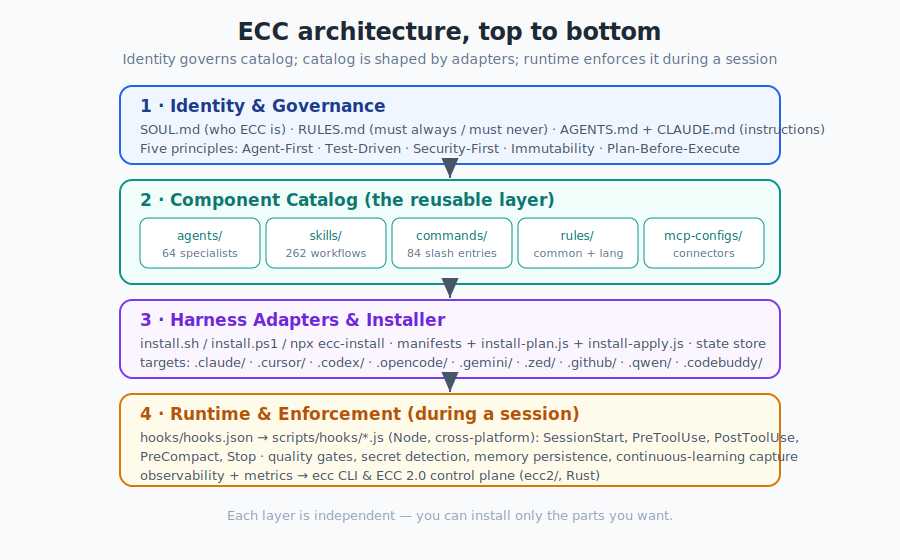

# Chapter 2 — The Mental Model & Architecture

[← Background & Philosophy](01-background-and-philosophy.md) · [Table of Contents](../README.md) · [Next: Installation →](03-installation.md)

---

## 2.1 The four layers

The fastest way to *understand* ECC (rather than memorize it) is to see it as four stacked layers. Each layer answers a different question, and each layer is shaped by the one above it.

<p align="center">
  
</p>

### Layer 1 — Identity & Governance ("who ECC is")
Three small root files set the constitution:

- **`SOUL.md`** — the core identity and the five principles.
- **`RULES.md`** — hard "Must Always / Must Never" constraints, plus the required formats for agents, skills, and hooks.
- **`AGENTS.md`** and **`CLAUDE.md`** — the instructions the assistant reads, including the agent roster, security guidelines, and workflow.

This layer is *why* everything else behaves the way it does.

### Layer 2 — Component Catalog ("the reusable stuff")
The heart of the repo — the things you install and invoke:

```text
agents/        skills/        commands/        rules/        mcp-configs/
```

This is the layer most of this book is about (Chapters 5–10).

### Layer 3 — Harness Adapters & Installer ("how it lands on disk")
The catalog is *generic*. Each AI tool wants its config in a different place and format. This layer translates:

- `install.sh` / `install.ps1` / `npx ecc-install` — the entry points.
- `manifests/` + `scripts/install-plan.js` + `scripts/install-apply.js` — the selective-install engine.
- A **state store** records what got installed, enabling clean updates and uninstalls.
- Targets: `.claude/`, `.cursor/`, `.codex/`, `.opencode/`, `.gemini/`, `.zed/`, `.github/`, `.qwen/`, `.codebuddy/`, …

### Layer 4 — Runtime & Enforcement ("what happens while you work")
When a session is actually running, this layer is alive:

- `hooks/hooks.json` maps events to **Node.js scripts** in `scripts/hooks/`.
- Hooks format code, scan for secrets, gate quality, persist memory, and capture learning signals.
- Metrics and observability feed the **`ecc` CLI** and the **ECC 2.0 control plane** (`ecc2/`).

> **Mental shortcut:** Identity *governs* the Catalog → the Catalog is *shaped* by Adapters → Adapters *land* it → the Runtime *enforces* it. Top governs bottom.

---

## 2.2 The repository map

Here is an annotated tour of the top-level tree. You will not touch most of these directly, but knowing the lay of the land removes a lot of mystery.

```text
ECC/
├── SOUL.md, RULES.md, AGENTS.md, CLAUDE.md   # Layer 1: identity & governance
├── VERSION                                   # 2.0.0
│
├── agents/            # 64 specialized sub-agents (*.md with frontmatter)
├── skills/            # 262+ skills, each in skills/<name>/SKILL.md
├── commands/          # 84 slash commands (legacy-compatible; skills-first)
├── legacy-command-shims/  # opt-in archive of retired short names (/tdd, /eval, …)
├── rules/             # common/ + per-language (typescript, python, golang, swift, php, arkts)
├── hooks/             # hooks.json + memory-persistence/ + README
├── mcp-configs/       # mcp-servers.json — MCP connector definitions
├── contexts/          # dev.md / review.md / research.md — system-prompt injection
│
├── scripts/           # cross-platform Node.js plumbing
│   ├── hooks/             # the actual hook implementations
│   ├── lib/               # shared utils, package-manager detection
│   ├── ecc.js             # the operator CLI (consult, doctor, repair, status, …)
│   ├── install-plan.js    # selective-install planner
│   ├── install-apply.js   # selective-install applier (also `ecc-install` bin)
│   └── … (orchestration, sessions, releases, audits)
│
├── ecc2/              # ECC 2.0 — Rust control-plane prototype (alpha)
├── ecc_dashboard.py   # Tkinter desktop GUI
│
├── install.sh / install.ps1    # installer entry points
├── manifests/         # install manifests for selective install
├── schemas/           # JSON schemas for validation
├── tests/             # test suite (node tests/run-all.js)
├── examples/          # example CLAUDE.md configs (SaaS, Go, Django, Rust, …)
│
├── the-shortform-guide.md      # "read this first" setup guide
├── the-longform-guide.md       # advanced patterns
├── the-security-guide.md       # agentic security
├── COMMANDS-QUICK-REF.md       # cheat sheet of slash commands
├── docs/              # deep docs (architecture, releases, per-harness guides, i18n)
│
└── per-harness config dirs:
    .claude/  .cursor/  .codex/  .opencode/  .gemini/  .zed/  .github/  .qwen/  .codebuddy/  .trae/
```

### The three guides are gold
The repo says it plainly: *"This repo is the raw code only. The guides explain everything."* The three `the-*-guide.md` files are the author's own teaching material and worth reading directly:

- **`the-shortform-guide.md`** — foundations: skills, hooks, subagents, MCPs, plugins. *Read first.*
- **`the-longform-guide.md`** — token economics, memory persistence, evals, parallelization.
- **`the-security-guide.md`** — attack vectors, sandboxing, CVEs, AgentShield.

This book distills and organizes all three (Chapters 11, 13, 14, 15), but the originals are excellent.

---

## 2.3 How a single request flows through ECC

Let's trace what actually happens when you type a request. Say you run `/ecc:plan "add OAuth login"`:

1. **Governance loads.** Rules and `AGENTS.md` are already in context, so the assistant knows the standards (TDD, immutability, security).
2. **SessionStart hook** (if installed) has already injected memory from prior sessions and detected your package manager.
3. **The command/skill fires.** `/plan` maps to planning logic, which may **delegate to the `planner` agent**.
4. **The agent works in a scoped context** with limited tools and an appropriate model, and returns a `plan.md`.
5. **You confirm.** Plan-before-execute means it waits for you.
6. **Implementation proceeds**, likely via the `tdd-workflow` skill and the `tdd-guide` agent.
7. **Hooks fire continuously** — formatting on every edit, type-checking, secret scanning, console.log warnings.
8. **Review** via `/code-review` (the `code-reviewer` agent) and `/security-scan`.
9. **Stop hook** writes a session summary and extracts any learnings.

Every layer participated. That orchestration is the whole point — and we will see it diagrammed in Chapter 5.

---

## 2.4 Two homes: source repo vs. installed config

A frequent source of confusion: there are **two places ECC lives**.

| | The source repo | Your installed config |
|---|------------------|------------------------|
| Where | `~/code/ECC` (a `git clone`) | `~/.claude/`, `.cursor/`, etc. |
| Contains | The full catalog, scripts, guides | Only the components you installed |
| You edit | When contributing / customizing source | When tweaking your live setup |
| Updated by | `git pull` | Re-running the installer / plugin update |

The installer reads from the source repo (or the plugin cache) and writes resolved files into your config directories. The **state store** remembers the mapping so `doctor`, `repair`, and `uninstall` can work precisely.

> **Note for plugin users:** With the Claude Code plugin, the "source" is a managed cache under `~/.claude/plugins/…`, not a clone you maintain. You still clone the repo separately if you want to copy `rules/` (plugins can't distribute rules — see Chapter 3).

---

## 2.5 Naming you'll see (and why it's confusing)

ECC has **three public identifiers** that are intentionally different:

| Context | Identifier |
|---------|-----------|
| GitHub source repo | `affaan-m/ECC` (and the short alias `affaan-m/ecc`) |
| Claude marketplace / plugin | `ecc@ecc` |
| npm package | `ecc-universal` |

So `npm install` and `/plugin install` use *different names on purpose*. The plugin id is kept short (`ecc@ecc`) to satisfy strict validators; the npm package kept its original `ecc-universal` name. Older posts may show a longer legacy marketplace id — treat that as deprecated.

---

## 2.6 Key takeaways

- ECC is four layers: **Identity → Catalog → Adapters → Runtime**, top governing bottom.
- The **catalog** (`agents/ skills/ commands/ rules/ mcp-configs/`) is what you install and invoke.
- The **installer + manifests + state store** translate the generic catalog onto each harness.
- The **runtime** (hooks → Node scripts) is what enforces standards live.
- There are **two homes**: the source repo and your installed config.
- Three names — `affaan-m/ECC`, `ecc@ecc`, `ecc-universal` — refer to the same project.

Now that you have the map, let's get it installed correctly the first time.

---

[← Background & Philosophy](01-background-and-philosophy.md) · [Table of Contents](../README.md) · [Next: Installation →](03-installation.md)
