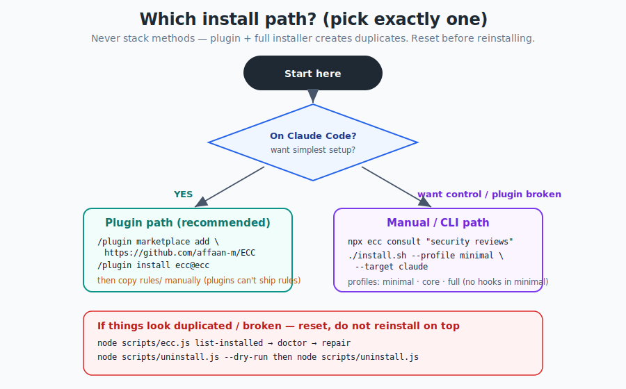

# Chapter 3 — Installation & Setup

[← Mental Model & Architecture](02-mental-model-architecture.md) · [Table of Contents](../README.md) · [Next: Core Concepts →](04-core-concepts.md)

---

This chapter is the one to get *exactly* right, because a sloppy install is the #1 cause of "ECC feels broken/duplicated." The good news: the rules are simple.

## 3.1 The one rule that prevents most problems

> **Pick exactly ONE install path. Never stack them.**

There are two paths:
1. **Plugin** (recommended default for Claude Code).
2. **Manual installer / CLI** (`install.sh`, `install.ps1`, `npx ecc-install`).

The classic broken setup is: run `/plugin install` *and then* `./install.sh --profile full`. The plugin already loads ECC's skills, commands, and hooks; the full installer then copies the same things into your user directories — giving you **duplicate skills and duplicate runtime behavior**. If you've already done this, jump to [§3.7 Reset](#37-reset--uninstall) before anything else.

<p align="center">
  
</p>

---

## 3.2 Requirements

- **Claude Code CLI v2.1.0 or later** (`claude --version`). The plugin's hook auto-loading behavior depends on it.
- **Node.js** (hooks and scripts are Node-based; cross-platform on Windows/macOS/Linux).
- A package manager — npm, pnpm, yarn, or bun. ECC auto-detects yours.

---

## 3.3 Path A — The plugin (recommended for Claude Code)

Inside a Claude Code session:

```text
/plugin marketplace add https://github.com/affaan-m/ECC
/plugin install ecc@ecc
```

Or wire it declaratively in `~/.claude/settings.json`:

```json
{
  "extraKnownMarketplaces": {
    "ecc": { "source": { "source": "github", "repo": "affaan-m/ECC" } }
  },
  "enabledPlugins": { "ecc@ecc": true }
}
```

This gives you the agents, skills, commands, and hooks instantly. **But not rules** — see §3.5.

> **Important hook gotcha (for contributors):** Do **not** add a `"hooks"` field to `.claude-plugin/plugin.json`. Claude Code v2.1+ auto-loads a plugin's `hooks/hooks.json` by convention; declaring it again causes a *"Duplicate hooks file detected"* error. There's a regression test guarding this precisely because it bit the repo repeatedly.

### Low-context / no-hooks variant
If hooks feel too intrusive or you only want rules/agents/commands/core skills, skip the plugin and use the minimal manual profile (see Path B). Hooks are intentionally excluded from `minimal`.

---

## 3.4 Path B — The manual installer / CLI

Clone, install deps, then run the installer with a **profile** and a **target**:

```bash
git clone https://github.com/affaan-m/ECC.git
cd ECC
npm install        # or pnpm / yarn / bun

# Minimal (no hooks-runtime), targeting Claude Code:
./install.sh --profile minimal --target claude
```

Windows PowerShell:

```powershell
.\install.ps1 --profile minimal --target claude
# or, without cloning:
npx ecc-install --profile minimal --target claude
```

### Profiles
| Profile | Roughly what you get |
|---------|----------------------|
| `minimal` | Rules, agents, commands, core workflow skills. **No `hooks-runtime`.** |
| `core` | The standard set. Use `--without baseline:hooks` to keep core but disable hooks. |
| `full` | Everything. Use this *only* on the fully manual path — never after a plugin install. |

### Adding/removing components precisely (selective install)
ECC v1.9+ has a manifest-driven selective installer. You can add a single capability or module:

```bash
# Add just the hooks runtime later:
./install.sh --target claude --modules hooks-runtime

# Keep core but skip hooks:
./install.sh --profile core --without baseline:hooks --target claude

# Add an ML capability on top of minimal:
npx ecc install --profile minimal --target claude --with capability:machine-learning
```

### Don't know what to install? Ask the advisor.
```bash
npx ecc consult "security reviews" --target claude
npx ecc consult "mlops training model deployment" --target claude
```
It returns matching components, related profiles, and preview/install commands. Preview before installing if you want to inspect the exact file plan.

---

## 3.5 Rules need a manual copy (always)

This trips everyone up: **Claude Code plugins cannot distribute `rules`** (an upstream limitation). So regardless of path, if you want ECC's always-follow guidelines, copy them yourself:

```bash
# User-level (applies to all projects)
mkdir -p ~/.claude/rules/ecc
cp -r rules/common ~/.claude/rules/ecc/
cp -r rules/typescript ~/.claude/rules/ecc/   # pick your stack
cp -r rules/python   ~/.claude/rules/ecc/
cp -r rules/golang   ~/.claude/rules/ecc/

# OR project-level (this project only)
mkdir -p .claude/rules/ecc
cp -r rules/common .claude/rules/ecc/
```

Rules of thumb:
- Start with **`rules/common`** plus **one** language pack you actually use.
- **Copy whole language directories** (e.g. `rules/golang`), not the files inside them, so relative references and filenames don't collide.
- Don't copy *every* rules directory unless you genuinely want all that context loaded.

---

## 3.6 Installing hooks correctly (manual path)

Do **not** hand-copy the repo's `hooks/hooks.json` into `~/.claude/settings.json`. That file is plugin/repo-oriented; raw copying isn't supported. Use the installer so command paths are rewritten correctly:

```bash
# macOS / Linux
bash ./install.sh --target claude --modules hooks-runtime
```
```powershell
# Windows
pwsh -File .\install.ps1 --target claude --modules hooks-runtime
```

That writes resolved hooks to `~/.claude/hooks/hooks.json` and leaves your `settings.json` untouched. If you used the **plugin**, you already have hooks auto-loaded — do **not** also copy them into `settings.json`.

> Windows note: the Claude config dir is `%USERPROFILE%\.claude`.

---

## 3.7 Reset / uninstall

If ECC feels duplicated, intrusive, or broken, **do not reinstall on top of itself.** Diagnose and clean first.

**Lifecycle wrapper (start here):**
```bash
node scripts/ecc.js list-installed   # what's installed
node scripts/ecc.js doctor           # diagnose
node scripts/ecc.js repair           # restore ECC-managed files
node scripts/ecc.js uninstall --dry-run
```

**Direct uninstall:**
```bash
node scripts/uninstall.js --dry-run   # preview
node scripts/uninstall.js             # remove ECC-managed files
```

ECC only removes files recorded in its install-state; it won't delete unrelated files.

**If you stacked methods, clean up in this order:**
1. Remove the Claude Code plugin install.
2. Run the ECC uninstall from the repo root (removes state-managed files).
3. Delete any extra rule folders you copied manually.
4. Reinstall once, using a single path.

> If your local Claude setup was wiped, you do **not** need to repurchase anything. Run `list-installed` → `doctor` → `repair` before reinstalling. Billing/account recovery for ECC Pro is a separate concern.

---

## 3.8 MCP servers are opt-in

Plugin installs intentionally do **not** auto-enable ECC's bundled MCP server definitions (this avoids overlong tool names on strict gateways and protects your context window). ECC ships exactly **one** default connector (`chrome-devtools`); everything else is a skill wrapping a CLI/REST API or an opt-in catalog entry.

To add MCP servers:
- Use Claude Code's `/mcp` command for live changes (persisted to `~/.claude.json`).
- For repo-local access, copy the servers you want from `mcp-configs/mcp-servers.json` into a project `.mcp.json`.
- If you already run your own copies, set `export ECC_DISABLED_MCPS="chrome-devtools"` so install/sync flows skip them.

Replace any `YOUR_*_HERE` placeholders with real keys. (Context-window discipline is covered in Chapter 10.)

---

## 3.9 Multi-model commands need extra setup

The `multi-*` commands (`/multi-plan`, `/multi-execute`, `/multi-backend`, `/multi-frontend`, `/multi-workflow`) are **not** covered by the base install. They depend on the `ccg-workflow` runtime:

```bash
npx ccg-workflow
```
That provides the external dependencies these commands expect (e.g. `~/.claude/bin/codeagent-wrapper`, `~/.claude/.ccg/prompts/*`). Without it, the `multi-*` commands won't run correctly.

---

## 3.10 Verifying your install

```bash
# In Claude Code: list what the plugin provides
/plugin list ecc@ecc

# From the repo: run the test suite
node tests/run-all.js

# Operator readiness snapshot (writes a portable handoff)
npx ecc status --markdown --write status.md
```

A successful manual install will show ECC-managed files via `node scripts/ecc.js list-installed`.

---

## 3.11 Other harnesses (quick pointers)

Full cross-harness detail is in [Chapter 12](12-cross-harness.md), but the target flag is the key:

```bash
./install.sh --target cursor typescript          # Cursor
./install.sh --profile minimal --target zed       # Zed
bash scripts/sync-ecc-to-codex.sh                  # Codex (merge into ~/.codex)
opencode                                           # OpenCode (auto-detects .opencode/)
```

---

## 3.12 Key takeaways

- **One path only.** Plugin *or* manual installer — never both.
- Plugin = fastest; **rules still need a manual copy** (`rules/common` + one language pack).
- Profiles: `minimal` (no hooks) · `core` · `full` (manual-only).
- Use `npx ecc consult "<need>"` if unsure what to install.
- Reset with `list-installed → doctor → repair`, then `uninstall --dry-run`, before reinstalling.
- MCP servers and `multi-*` commands are deliberately opt-in.

With ECC installed, let's learn the vocabulary: the six building blocks.

---

[← Mental Model & Architecture](02-mental-model-architecture.md) · [Table of Contents](../README.md) · [Next: Core Concepts →](04-core-concepts.md)
