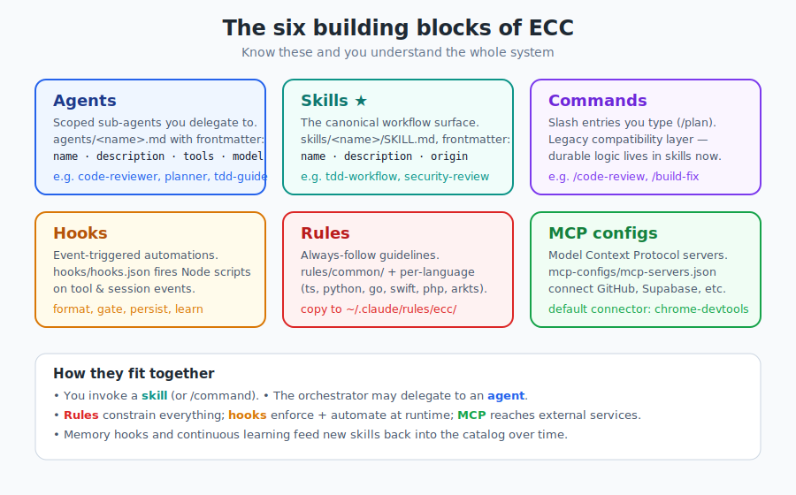
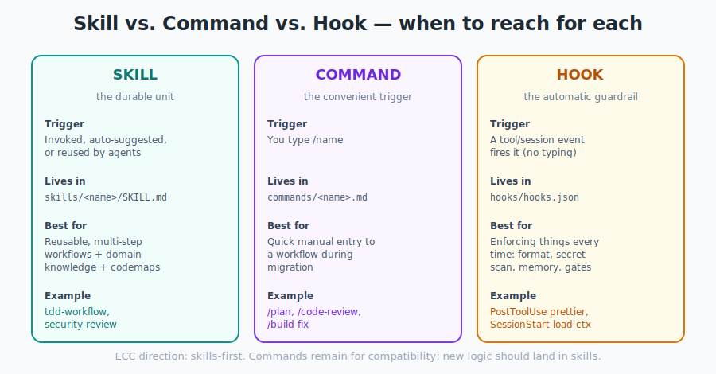

# 第 4 章 —— 核心概念：六大建構模塊

[← 安裝](03-installation_hk.md) · [目錄](../README_hk.md) · [下一章：代理 →](05-agents_hk.md)

---

ECC 裏面所有嘢都由六種東西組成。學識呢六種,成個系統就會即時聚焦清晰。呢一章係地圖;第 5–10 章會逐一放大。

<p align="center">
  
</p>

---

## 4.1 六者一覽

| 模塊 | 一句話概括 | 住喺邊 | 你如何互動 |
|-------|-----------|----------|-----------------|
| **代理（Agents）** | 你委派工作的範圍受限專家 | `agents/<name>.md` | 編排器委派;你亦可以指定要某一個 |
| **技能（Skills）★** | 可重用、多步驟的工作流程 + 知識 | `skills/<name>/SKILL.md` | 呼叫、自動建議,或代理重用 |
| **指令（Commands）** | 觸發工作流程的斜線指令 | `commands/<name>.md` | 你打 `/name` |
| **掛鈎（Hooks）** | 由事件觸發的自動化 | `hooks/hooks.json` → `scripts/hooks/*.js` | 無——佢哋自動觸發 |
| **規則（Rules）** | 常駐遵守的準則 | `rules/common/` + 各語言 | 每次會話都載入上下文 |
| **MCP 設定** | 連接外部服務的連接器 | `mcp-configs/mcp-servers.json` | 按專案啟用;模型呼叫工具 |

★ 技能係**標準（canonical）**介面。有疑問嗰陣,用技能去思考。

---

## 4.2 它們如何互相關聯

一個有用嘅方法,將六者一齊放入腦：

- **規則**係*憲法*——被動、永遠存在、約束一切。
- **技能**係*戰術手冊*——耐用嘅「我哋喺度點做 X」。
- **指令**係*捷徑*——方便嘅打字觸發器,愈嚟愈薄,只係技能嘅包裝。
- **代理**係*團隊*——編排器交付工作畀嘅專家,經常會用技能。
- **掛鈎**係*反射動作*——喺事件發生時觸發,唔使任何人開口。
- **MCP**係*電話線*——模型藉以接通 GitHub、資料庫、瀏覽器嘅方式。

一個單一嘅功能請求可能觸及全部六者：一個**指令**啟動一個**技能**,佢委派畀一個**代理**,全部**受規則約束**,每次編輯都有**掛鈎**觸發,而一個 **MCP** 伺服器負責抓取資料。嗰種編舞*就係* ECC。

---

## 4.3 技能 vs. 指令 vs. 掛鈎 —— 三個「主動」介面

呢三者係人哋最易混淆嗰啲,因為三者都可以「做一個工作流程」。分別在於**觸發方式**同**耐用程度**。

<p align="center">
  
</p>

- **技能**係被呼叫嘅（由你或自動），而且係*耐用嘅單位*。新邏輯應該放呢度。
- **指令**係*你打出嚟*嘅嘢（`/plan`）。ECC 為咗相容性而保留指令,但正將佢哋嘅邏輯遷移入技能。
- **掛鈎**係*由事件觸發*嘅（一次檔案編輯、會話開始）——你永遠唔會打佢。

> **經驗法則：** 「呢樣嘢應唔應該喺 X 發生時*每一次*都運行,無論點都好？」→ **掛鈎**。「呢樣嘢係*我揀去運行嘅工作流程*嗎？」→ **技能**（可選配一個 `/command` 捷徑）。

---

## 4.4 兩項橫切能力

喺六大模塊之上,有兩項能力將一切串連起嚟。佢哋各有專章,因為佢哋正正令 ECC 感覺*活生生*而唔係靜態：

- **記憶**（第 9 章）：hooks 儲存你嘅會話狀態,下次再載入,令助手唔使每日由零開始。
- **持續學習**（第 13 章）：重複出現嘅模式變成*本能（instincts）*,`/evolve` 將佢哋聚類成全新嘅技能。目錄會由你自己嘅使用中成長。

---

## 4.5 frontmatter 慣例

代理同技能其實只係帶有 YAML 標頭（frontmatter）嘅 Markdown 檔案。標頭話畀框架知點樣對待呢個檔案。你會不斷見到呢個模式：

```markdown
---
name: code-reviewer
description: When to use this. Be specific — this drives auto-selection.
tools: ["Read", "Grep", "Glob", "Bash"]   # agents only
model: sonnet                              # agents only
origin: ECC                                # skills only
---

The body: the actual instructions / workflow.
```

`description` 欄位承擔咗重任：佢係框架決定*何時*呈現呢個代理或技能嘅依據。含糊嘅描述會被忽略;精準嘅就會被採用。

---

## 4.6 重點摘要

- ECC 由六大模塊組成：**代理、技能、指令、掛鈎、規則、MCP 設定。**
- **技能係標準**;指令愈嚟愈薄,只係捷徑;掛鈎係自動嘅。
- 規則約束;代理執行;MCP 連接;記憶 + 學習令佢隨時間進步。
- 代理同技能係 Markdown + YAML frontmatter;`description` 驅動自動選擇。

我哋由你委派工作嘅團隊開始：**代理。**

---

[← 安裝](03-installation_hk.md) · [目錄](../README_hk.md) · [下一章：代理 →](05-agents_hk.md)
