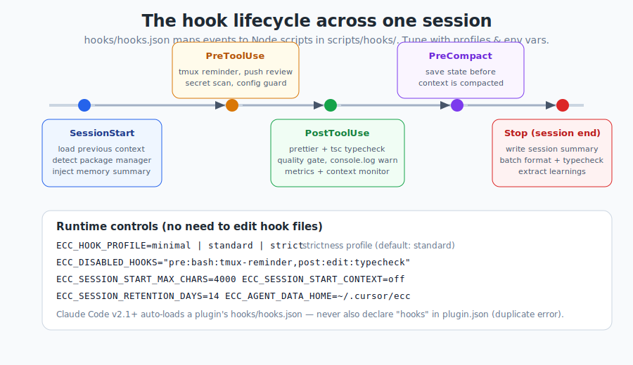

# 第 8 章 —— 掛鈎（Hooks）

[← 指令](07-commands_hk.md) · [目錄](../README_hk.md) · [下一章：規則與記憶 →](09-rules-and-memory_hk.md)

---

## 8.1 何謂掛鈎

一個**掛鈎（hook）**係喺特定事件上觸發嘅自動化——一次工具呼叫、一個會話開始、上下文即將被壓縮。同技能、指令唔同,你永遠唔會呼叫一個掛鈎;係框架觸發佢。掛鈎係 ECC 嘅**反射動作**：格式化、把守、秘密資料掃描同記憶儲存,呢啲應該*每一次*都自動發生、唔使你記住要做嘅嘢。

喺 ECC 入面,`hooks/hooks.json` 宣告各個事件同匹配器（matchers），而每一個項目會運行 `scripts/hooks/` 下嘅一個 **Node.js 腳本**。（用 Node,而唔係內聯 bash,係為咗跨平台可靠性——由 v1.8 起刻意做嘅硬化。）

---

## 8.2 事件生命週期

<p align="center">
  
</p>

主要事件（Claude Code 嘅命名;其他框架對應到呢啲）：

| 事件 | 何時觸發 | ECC 用佢嚟… |
|-------|-------|------------------|
| **SessionStart** | 新會話開始 | 載入先前上下文、偵測套件管理器、注入一份記憶摘要 |
| **PreToolUse** | 一個工具運行之前 | 提醒用 `tmux`、把守 `git push`、掃描秘密資料、保護設定檔、首次編輯前強制查證事實 |
| **PostToolUse** | 一個工具完成之後 | 格式化（prettier）、型別檢查（tsc）、品質關卡、就 `console.log` 發警告、更新指標同上下文監視器 |
| **PostToolUseFailure** | 一個工具出錯 | 為診斷擷取失效上下文 |
| **PreCompact** | 上下文壓縮之前 | 先將重要狀態存入一個檔案 |
| **Stop** | 會話結束 | 寫一份會話摘要、批次格式化／型別檢查、提取學習所得 |

你會喺 `hooks.json` 見到幾個具代表性嘅 ECC 掛鈎（按 id）：

- `pre:bash:dispatcher` —— 一個整合咗嘅 Bash 預檢（品質、tmux、push、關卡檢查）。
- `pre:edit-write:gateguard-fact-force` —— 阻止每個檔案嘅*第一次*編輯,並要求喺允許改動之前先做調查（邊個 import 緊呢個？schema 係乜？用戶實際問緊乜？）。
- `pre:config-protection` —— 阻止編輯 linter／formatter 設定,引導代理去修程式碼,而唔係削弱設定。
- `post:quality-gate` —— 喺編輯之後跑品質檢查。
- `post:edit:console-warn` —— 就 `console.log` 發警告。
- `post:ecc-context-monitor` —— 喺上下文耗盡、高成本、範圍蔓延或工具迴圈時注入警告。
- `session:start` —— SessionStart 引導程序（記憶 + 套件管理器）。
- `pre:compact` / Stop 摘要 —— 記憶持久化（第 9 章）。

> `hooks.json` 裏面實際嘅 `command` 字串睇落好複雜,因為每一個都要喺委派畀真正腳本之前,先喺好多可能嘅安裝位置之中引導出正確嘅外掛根目錄。你永遠唔會親手寫嗰啲——安裝器會生成佢。

---

## 8.3 唔使編輯檔案就調校掛鈎

呢個係 ECC 最好嘅功能之一。你用**環境變數**控制掛鈎行為——唔使改 JSON：

```bash
# 嚴格程度設定檔：minimal | standard | strict   （預設：standard）
export ECC_HOOK_PROFILE=standard

# 按 id 停用特定掛鈎（逗號分隔）
export ECC_DISABLED_HOOKS="pre:bash:tmux-reminder,post:edit:typecheck"

# 限制或停用 SessionStart 上下文注入
export ECC_SESSION_START_MAX_CHARS=4000
export ECC_SESSION_START_CONTEXT=off        # 用於低上下文／本地模型

# 會話保留時間窗（日）（0/off/never = 全部保留）
export ECC_SESSION_RETENTION_DAYS=14

# 保留上下文／範圍／迴圈警告，但隱藏 API 速率成本估算
export ECC_CONTEXT_MONITOR_COST_WARNINGS=off

# 可選加入的治理事件擷取
export ECC_GOVERNANCE_CAPTURE=1
```

Windows PowerShell：
```powershell
[Environment]::SetEnvironmentVariable('ECC_SESSION_RETENTION_DAYS', '14', 'User')
```

每個掛鈎都標註咗佢喺邊啲設定檔下運行（例如 `standard,strict`）。所以 `ECC_HOOK_PROFILE=minimal` 會靜靜咁丟低較嘈嘅嗰啲,而 `strict` 就會將所有嘢開晒。

---

## 8.4 「Duplicate hooks file」陷阱

最多人回報嘅單一掛鈎問題。Claude Code **v2.1+ 會按慣例自動載入**外掛嘅 `hooks/hooks.json`。如果你*同時*喺 `.claude-plugin/plugin.json` 宣告 hooks,或者喺裝咗外掛之後將 `hooks.json` 複製入 `settings.json`,你就會得到：

```text
Duplicate hooks file detected: ./hooks/hooks.json resolves to already-loaded file
```

避免方法：
- **貢獻者：** 永遠唔好喺 `plugin.json` 加入 `"hooks"` 欄位（有一個迴歸測試強制執行呢點）。
- **外掛用戶：** 唔好將 hooks 複製入 `settings.json`——佢哋已經載入咗。
- **手動用戶：** 透過 `./install.sh --target claude --modules hooks-runtime` 安裝 hooks,佢會寫入 `~/.claude/hooks/hooks.json`,並唔郁 `settings.json`。

---

## 8.5 掛鈎的概念形狀

如果你剝走引導包裝器,一個掛鈎項目其實只係：

```json
{
  "matcher": "Edit|Write|MultiEdit",
  "hooks": [
    { "type": "command", "command": "node scripts/hooks/quality-gate.js", "async": true, "timeout": 30 }
  ],
  "description": "Run quality gate checks after file edits",
  "id": "post:quality-gate"
}
```

- **`matcher`** —— 呢個適用於邊個（啲）工具或事件（`Bash`、`Edit|Write|MultiEdit` 或 `*`）。
- **`hooks[].command`** —— 要運行嘅腳本。
- **`async` / `timeout`** —— 唔好阻塞代理;限制運行時間。
- **`id`** —— 你喺 `ECC_DISABLED_HOOKS` 用嘅句柄。

退出碼慣例（來自 `RULES.md`）：**只**喺刻意阻擋時退出 `1`（硬阻擋用 `2`）;否則退出 `0`。訊息應該**可付諸行動**。

指南裏面一個最小化嘅手寫範例（就 `console.log` 發警告）：
```json
{
  "matcher": "tool == \"Edit\" && tool_input.file_path matches \"\\\\.(ts|tsx|js|jsx)$\"",
  "hooks": [{
    "type": "command",
    "command": "#!/bin/bash\ngrep -n 'console\\.log' \"$file_path\" && echo '[Hook] Remove console.log' >&2"
  }]
}
```

---

## 8.6 用簡單的方法建立掛鈎

親手寫掛鈎 JSON 好麻煩。短篇指南推薦 **`hookify`** 方法：跑 `/hookify`,然後用對話方式*描述*你想要乜,佢就會幫你生成掛鈎。ECC 仲附帶 `/hookify-list`、`/hookify-configure` 同 `/hookify-help`。

如果你手動編寫一個,用 `node scripts/ci/validate-hooks.js` 驗證（`npm test` 嘅一部分）。

---

## 8.7 掛鈎在實戰中給你甚麼

當掛鈎處於 `standard` 時,一個普通嘅編輯會話會靜靜咁得到：

- 編輯之後**自動格式化 + 型別檢查**（唔再「唔記得跑 prettier」）。
- 喺有風險嘅工具呼叫同提交提示詞之前進行**秘密資料偵測**。
- 一道 **`git push` 審查關卡**,令推送唔再悄無聲息。
- 一個用於長時間運行指令嘅 **`tmux` 提醒**。
- 跨會話嘅**記憶持久化**。
- 餵入 instincts 嘅**持續學習擷取**。
- 一個喺你撞牆之前警告你嘅**上下文監視器**。

零持續努力就換到咁多資深工程師嘅紀律。

---

## 8.8 重點摘要

- 掛鈎係喺工具／會話事件上**自動**嘅反射;`hooks.json` → Node 腳本。
- 生命週期：**SessionStart → PreToolUse → PostToolUse → PreCompact → Stop。**
- 用 **`ECC_HOOK_PROFILE`** 同 **`ECC_DISABLED_HOOKS`** 喺執行階段調校——唔使改檔案。
- 永遠唔好重複載入 hooks（「Duplicate hooks file」陷阱）——用正確嘅方法安裝佢哋。
- 用 **`/hookify`** 以描述方式建立掛鈎,而唔係寫 JSON。

下一章：常駐嘅準則,同跨會話留存嘅記憶。

---

[← 指令](07-commands_hk.md) · [目錄](../README_hk.md) · [下一章：規則與記憶 →](09-rules-and-memory_hk.md)
