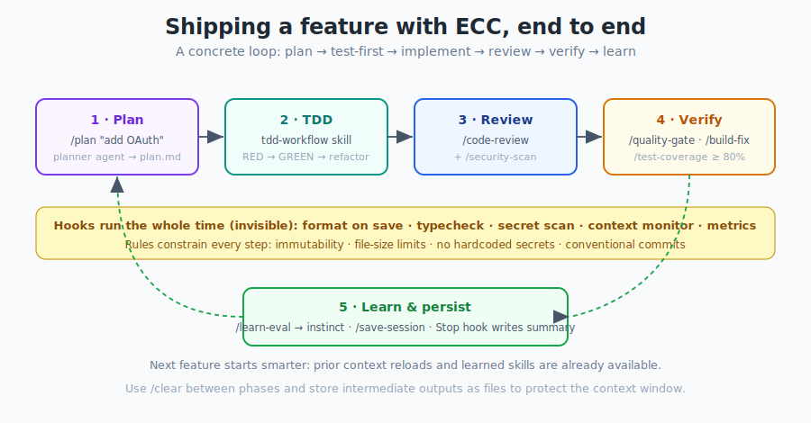
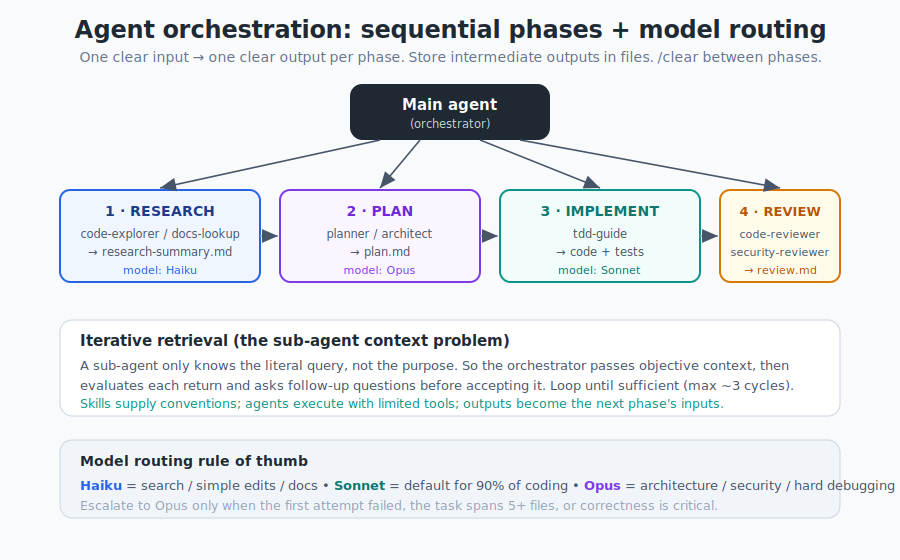

# 第 11 章 —— 日常工作流程

[← MCP 與上下文](10-mcp-and-context_hk.md) · [目錄](../README_hk.md) · [下一章：跨框架使用 →](12-cross-harness_hk.md)

---

呢一章係你會不斷返嚟睇嗰一章。佢將所有組件轉化成具體、可重複嘅迴圈。複製佢哋、改編佢哋,然後佢哋就會變成肌肉記憶。

## 11.1 主迴圈：規劃 → TDD → 審查 → 驗證 → 學習

幾乎每一個 ECC 會話都遵循同一個形狀。

<p align="center">
  
</p>

```text
1. Plan        /plan "add OAuth login"        → planner agent → plan.md (you confirm)
2. TDD         tdd-workflow skill             → RED → GREEN → refactor (tdd-guide)
3. Review      /code-review + /security-scan  → code-reviewer + security-reviewer
4. Verify      /quality-gate, /build-fix      → /test-coverage ≥ 80%
5. Learn       /learn-eval, /save-session     → instinct + session summary (Stop hook)
```

環繞住成個流程,**hooks** 無形咁進行格式化／型別檢查／秘密資料掃描,而**規則**約束每一步。喺各階段之間,用 `/clear`,並將中間輸出存做檔案,咁你先唔會淹沒上下文視窗。

---

## 11.2 配方：開始一個新功能

```text
/ecc:plan "Add user authentication with OAuth"
   → planner 產出一個分階段嘅實作藍圖；你批准

(呼叫 tdd-workflow 技能)
   → tdd-guide：先寫失敗測試，然後寫最小化實作

/code-review
   → code-reviewer 檢查 diff（如果乾淨就回傳零項發現）
```

點解用呢個次序？**先規劃後執行**阻止範圍蔓延。**測試先行**意味住實作受一份規格指引。**即時審查**喺上下文仲新鮮嗰陣捉到問題。

---

## 11.3 配方：修復一個 bug

```text
(呼叫 tdd-workflow)
   → tdd-guide：寫一個能夠重現呢個 bug 嘅失敗測試（有效嘅 RED 狀態）
   → 實作修復；確認個測試變成 GREEN

/code-review
   → code-reviewer：捉返迴歸（regressions）
```

呢度嘅紀律係第 6 章嗰個 **RED 關卡**：喺動生產程式碼*之前*,你必須有一個基於預期原因而真正失敗嘅測試。冇重現,就冇修復。

---

## 11.4 配方：為生產做準備

```text
/security-scan        → security-reviewer：對齊 OWASP 的審計（或 AgentShield）
(呼叫 e2e-testing)    → e2e-runner：關鍵用戶流程測試（Playwright）
/test-coverage        → 驗證 80%+ 覆蓋率
/quality-gate         → 對照專案標準嘅最終關卡
```

---

## 11.5 配方：用子代理編排一個較大的建構

對於多階段工作,倚靠順序階段編排（第 5 章）：

<p align="center">
  
</p>

```text
Phase 1 RESEARCH   → research-summary.md   (cheap model)
Phase 2 PLAN       → plan.md               (Opus for hard design)
Phase 3 IMPLEMENT  → code + tests          (Sonnet)
Phase 4 REVIEW     → review.md
Phase 5 VERIFY     → done or loop back to the failing phase
```

`orch-*` 指令（`/orch-build-mvp`、`/orch-add-feature`、`/orch-fix-defect`……）將呢啲模式打包。如要多模型協作,有 `multi-*` 指令存在（記住佢哋需要 `ccg-workflow` 執行階段——第 3 章）。

---

## 11.6 並行化：一次做更多

當一個會話唔夠用時,ECC 嘅指引（來自長篇指南）係深思熟慮嘅,而唔係「開 10 個終端機」。

**為唔重疊嘅工作 fork。** 用 `/fork` 為提問／研究分叉出一個對話,同時你嘅主對話繼續編輯程式碼。將程式碼改動留喺主對話;用 fork 做唯讀探索。

**為重疊嘅程式碼工作用 git worktrees。** 當多個實例必須編輯重疊嘅程式碼時,畀每個各自嘅 checkout：
```bash
git worktree add ../feature-a feature-a
git worktree add ../feature-b feature-b
cd ../feature-a && claude      # 每個 worktree 一個實例
```
用 `/rename` 為你嘅對話命名,咁你先唔會跟唔到。

**串級方法（cascade）。** 喺右邊嘅分頁開新任務,由左掃到右（最舊→最新），同一時間最多聚焦喺 **3–4 個任務**。

> 指導原則：*「用最低限度可行嘅並行化量,你可以完成幾多嘢？」* 只喺真正必要時先加一個終端機。

---

## 11.7 配方：雙實例專案啟動

長篇指南中一個用於全新（greenfield）工作嘅好模式——兩個 Claude 實例喺一個空 repo 上：

- **實例 1 —— 鷹架代理：** 鋪設專案結構同設定（`CLAUDE.md`、規則、代理）。
- **實例 2 —— 深度研究代理：** 連接服務同網絡搜尋、撰寫 PRD、繪製架構圖,並收集真實嘅文件片段（如果文件網站有提供,攞個 `llms.txt`）。

然後佢哋會合：鷹架同經研究嘅計劃相遇。

---

## 11.8 配方：一天結束的交接

唔好等一個會話蒸發。擷取佢：
```text
/learn-eval       # 提取可重用嘅模式，並喺儲存前自我評估佢哋
/save-session     # 將狀態快照到 session-data/
```
或者倚靠 **Stop hook** 自動寫一份摘要。第二朝：
```text
/resume-session   # 重新載入最新會話並繼續
```
如要一份可攜、可共享嘅狀態（用於站立會議或交接畀隊友都好正）：
```bash
npx ecc status --markdown --write status.md
```

---

## 11.9 驗證迴圈與評估（evals）

ECC 將驗證當作一等公民工作流程,而唔係事後孔明。兩種評估風格（長篇指南）：

- **基於檢查點** —— 設定明確嘅檢查點、對照準則驗證、修好先再前進。
- **持續式** —— 每 N 分鐘,或者喺重大改動之後運行（完整測試套件 + lint）。

以及兩種解讀可靠性嘅方式：
```text
pass@k : k 次嘗試中至少有 ONE 次成功   (你只係需要佢行得到嗰陣用)
pass^k : k 次嘗試 ALL 全部成功          (一致性至關重要嗰陣用)
```
`eval-harness` 同 `verification-loop` 技能實作呢啲;`/quality-gate` 係日常嘅關卡。

---

## 11.10 幾個高槓桿習慣

來自各指南,一啲回報巨大嘅小事：
- **停用自動壓縮**,喺邏輯斷點策略性咁壓縮。
- **喺 `tmux` 跑長指令**,咁你可以分離／重新接上同串流日誌（ECC 甚至會提醒你）。
- **用 `mgrep`** 取代 grep,將搜尋 token 減半。
- **設定一條狀態列**（`/statusline`）,顯示分支、上下文 %、模型同待辦事項。
- 每個專案**保持 MCP 精簡**（<10 / <80）。
- **commit 之前審查 diff**——畀 `git push` hook 把守你。

---

## 11.11 重點摘要

- 主迴圈係**規劃 → TDD → 審查 → 驗證 → 學習**,包裹喺 hooks 同規則之中。
- 修復之前,用一個**有效嘅 RED 測試**重現 bug。
- 用**順序階段**編排大型工作,喺代理之間傳遞檔案。
- 用 **`/fork`、git worktrees 同串級方法**並行化——適可而止。
- **擷取每一個會話**（`/learn-eval`、`/save-session`、Stop hook），令聽日領先開始。
- 用**檢查點／持續評估**同 **pass@k vs pass^k** 思維去驗證。

下一章：以上所有嘢點樣跨越唔同嘅 AI 工具。

---

[← MCP 與上下文](10-mcp-and-context_hk.md) · [目錄](../README_hk.md) · [下一章：跨框架使用 →](12-cross-harness_hk.md)
