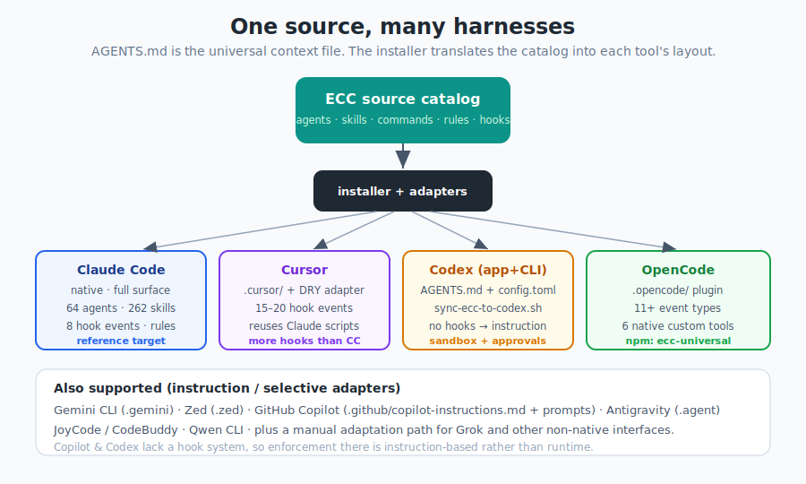

# 第 12 章 —— 跨框架使用

[← 日常工作流程](11-everyday-workflows_hk.md) · [目錄](../README_hk.md) · [下一章：持續學習 →](13-continuous-learning_hk.md)

---

## 12.1 大概念：寫一次，到處運行

雖然個名叫「Everything *Claude* Code」,但 ECC 係多工具嘅。佢自稱係 *「第一個將每一款主流 AI 編程工具發揮到極致嘅外掛」*。你只需編寫你嘅代理、技能同規則一次,安裝器就會將佢哋翻譯成每個框架嘅原生佈局。

<p align="center">
  
</p>

兩個架構決策令呢個成事：

1. **位於 repo 根目錄嘅 `AGENTS.md` 係通用上下文檔案** —— Claude Code、Cursor、Codex 同 OpenCode 一律會讀。（GitHub Copilot 改用 `.github/copilot-instructions.md`。）
2. **一個 DRY 轉接器模式**令其他框架可以*重用* Claude Code 嘅 hook 腳本,而唔使複製佢哋。例如 Cursor 嘅 `adapter.js`,會將 Cursor 嘅事件 JSON 轉換成 Claude 嘅 `scripts/hooks/*.js` 所期望嘅形狀。

安裝目標只係一個旗標：`--target claude | cursor | codex | opencode | zed | …`。

---

## 12.2 框架計分卡

功能覆蓋因工具而異。一個濃縮嘅視圖（數字為 v2.0.0,會浮動）：

| 功能 | Claude Code | Cursor | Codex（app+CLI） | OpenCode | GitHub Copilot |
|---------|-------------|--------|------------------|----------|----------------|
| 代理 | 64 | 透過 AGENTS.md 共享 | 共享 | 12 | 不適用 |
| 指令 | 84 | 共享 | 基於指示 | 35 | 5 個 prompts |
| 技能 | 262 | 共享 | ~10 個原生 | 37 | 透過指示 |
| Hook 事件 | 8 | 15 | 暫時冇 | 11 | 冇 |
| 規則 | 34 | 34（YAML frontmatter） | 基於指示 | 13 | 1 個常駐檔案 |
| MCP | 14 | 共享 | 6–7（TOML） | 完整 | 不適用 |
| 上下文檔案 | CLAUDE.md + AGENTS.md | AGENTS.md | AGENTS.md | AGENTS.md | copilot-instructions.md |

**咁樣解讀：** Claude Code 係參考目標（介面最豐富）。Cursor 同 OpenCode 其實有*更多* hook 事件。Codex 同 Copilot 冇 hook 系統,所以嗰度嘅強制執行係*基於指示*,而唔係執行階段。

---

## 12.3 Claude Code（原生）

主要目標——本書所有嘢都直接適用。透過外掛或手動安裝器安裝（第 3 章）。需要 CLI **v2.1.0+**。

---

## 12.4 Cursor

預先翻譯好嘅設定住喺 `.cursor/`。安裝：
```bash
./install.sh --target cursor typescript
./install.sh --target cursor python golang swift php
```
你會得到：15 個 hook 事件、16 個薄 hook 腳本（透過 `adapter.js` 委派畀共享嘅 `scripts/hooks/`）、34 條規則（帶 `description`/`globs`/`alwaysApply` 嘅 YAML frontmatter）、安裝為 `.cursor/agents/ecc-*.md` 嘅代理（加前綴以避免碰撞），加上共享嘅技能／指令／MCP。

**記憶隔離喺呢度好重要。** 因為 Cursor 重用同一批 hook 腳本,ECC 會自動將 Cursor 嘅記憶擺出 `~/.claude` 之外（透過一個設定 `ECC_AGENT_DATA_HOME` 嘅 `sessionStart` hook、一個 `~/.cursor/ecc` 嘅預設值、一個 `.cursor/ecc-agent-data.json` 覆寫,以及一條常駐規則）。如要刻意同 Claude Code *共享*記憶,將 `ECC_AGENT_DATA_HOME` 指向 `~/.claude`。

Cursor 嘅 hook 系統其實比 Claude 豐富（20 對 8 個事件）：`beforeShellExecution`、`afterFileEdit`、`beforeSubmitPrompt`（秘密資料偵測）、`beforeTabFileRead`（阻止 Tab 讀取 `.env`/`.key`/`.pem`）、`beforeMCPExecution`/`afterMCPExecution`（審計日誌）等等。

---

## 12.5 Codex（macOS app + CLI）

透過 `AGENTS.md` + `.codex/config.toml` 嘅一等支援。最乾淨嘅設定係嗰個同步腳本：
```bash
npm install && bash scripts/sync-ecc-to-codex.sh
# 只新增式合併入 ~/.codex；--dry-run 預覽，--update-mcp 刷新伺服器
```
或者直接喺 repo 跑 `codex`——根目錄 `AGENTS.md` 同 `.codex/` 會被自動偵測。參考嘅 `.codex/config.toml` 刻意唔釘死 `model`/`model_provider`（Codex 用佢自己嘅預設）。

包含咩：頂層 approvals/sandbox/web_search 設定、6 個 MCP 伺服器（透過 `--update-mcp` 連 Supabase 共 7 個）、`.agents/skills/` 下 32 個技能、兩個設定檔（`strict` 唯讀、`yolo` 全自動批准），以及三個範例代理角色（`explorer`、`reviewer`、`docs_researcher`）。

**關鍵限制：** Codex 暫時**冇 hook 執行對等性**,所以 ECC 嘅強制執行係透過 `AGENTS.md`、可選嘅 `model_instructions_file` 覆寫,以及 sandbox/approval 設定,基於指示去做。實驗性嘅 Codex 外掛 marketplace 路線喺上游好脆弱;偏向用同步腳本。

---

## 12.6 OpenCode

透過 `.opencode/` 嘅完整外掛支援。直接喺 repo 跑佢：
```bash
npm install -g opencode
opencode      # 自動偵測 .opencode/opencode.json
```
或者安裝已發佈嘅外掛：
```bash
npm install ecc-universal
# 然後喺 opencode.json：  { "plugin": ["ecc-universal"] }
```
注意：npm 外掛啟用 ECC 嘅 OpenCode hooks/events 同外掛工具——佢**唔會**自動加入完整嘅指令／代理／指示目錄。如要完整設定,喺 repo 內運行 OpenCode,或者將 `.opencode/` 資產複製入你嘅專案,並喺 `opencode.json` 接駁 `instructions`/`agent`/`command`。

OpenCode 嘅外掛系統好精密（20+ 種事件類型）。ECC 將 Claude 嘅 hooks 對應到 OpenCode 事件（`tool.execute.before/after`、`session.idle`、`session.created/deleted`），並加入額外嘅嘢好似 `file.edited` 同 `lsp.client.diagnostics`。佢亦暴露**6 個原生自訂工具**（run-tests、check-coverage、security-audit……）。

---

## 12.7 GitHub Copilot（VS Code）

唔使額外工具—— Copilot Chat 會自動讀指示同 prompt 檔案：
- `.github/copilot-instructions.md` —— 永遠注入嘅核心規則（編程風格、安全、測試、git）。
- `.github/prompts/*.prompt.md` —— 可重用、按需嘅 prompts：`plan`、`tdd`、`security-review`、`build-fix`、`refactor`。
- `.vscode/settings.json` —— 按任務嘅指示疊層（程式碼生成、測試生成、commit 訊息）同 `chat.promptFiles` 啟用。

**限制：** Copilot **冇 hook 系統,亦冇子代理 API**,所以 ECC 嘅自動化同代理委派唔適用。你喺每個對話仍然得到完整嘅編程*理念*。

---

## 12.8 其餘嘅

- **Gemini CLI** —— 透過 `.gemini/GEMINI.md` 嘅實驗性專案本地支援。
- **Zed** —— 保守嘅 `.zed/` 轉接器：`./install.sh --profile minimal --target zed`。將 API 金鑰保存喺 Zed 自己嘅設定,而唔係 repo。
- **Antigravity** —— 緊密整合嘅設定（`.agent/`）;見 `docs/ANTIGRAVITY-GUIDE.md`。
- **JoyCode / CodeBuddy** —— 專案本地選擇性安裝轉接器;見 `docs/JOYCODE-GUIDE.md`。
- **Qwen CLI** —— home 目錄選擇性轉接器;見 `docs/QWEN-GUIDE.md`。
- **非原生（Grok 等）** —— 一條手動後備路線;見 `docs/MANUAL-ADAPTATION-GUIDE.md`。

---

## 12.9 在自訂端點／閘道上運行

ECC 唔會硬編碼 Anthropic 傳輸,所以佢透過 Claude Code 正常嘅閘道支援運作：
```bash
export ANTHROPIC_BASE_URL=https://your-gateway.example.com
export ANTHROPIC_AUTH_TOKEN=your-token
claude
```
如果你嘅閘道重新對應模型名稱,喺 Claude Code 設定,而唔係 ECC。一旦 `claude` 行得到,ECC 嘅技能／hooks／指令／規則就同供應商無關。（注意：一個惡意專案覆寫 `ANTHROPIC_BASE_URL` 曾經係一個真實嘅 CVE——見第 15 章。）

---

## 12.10 重點摘要

- ECC 係**多框架**：編寫一次,安裝器適配佢（只需改 `--target`）。
- **`AGENTS.md`** 係通用上下文檔案;一個 **DRY 轉接器**跨工具重用 hook 腳本。
- **Claude Code** 係參考;**Cursor/OpenCode** 有更多 hook 事件;**Codex/Copilot** 冇 hooks（基於指示嘅強制執行）。
- 用 `ECC_AGENT_DATA_HOME` 喺各框架之間**隔離記憶**。
- Codex 設定 = `sync-ecc-to-codex.sh`;OpenCode = 喺 repo 內運行或用 `ecc-universal` 外掛;Copilot = 指示／prompt 檔案。

下一章：ECC 點樣愈用愈聰明。

---

[← 日常工作流程](11-everyday-workflows_hk.md) · [目錄](../README_hk.md) · [下一章：持續學習 →](13-continuous-learning_hk.md)
