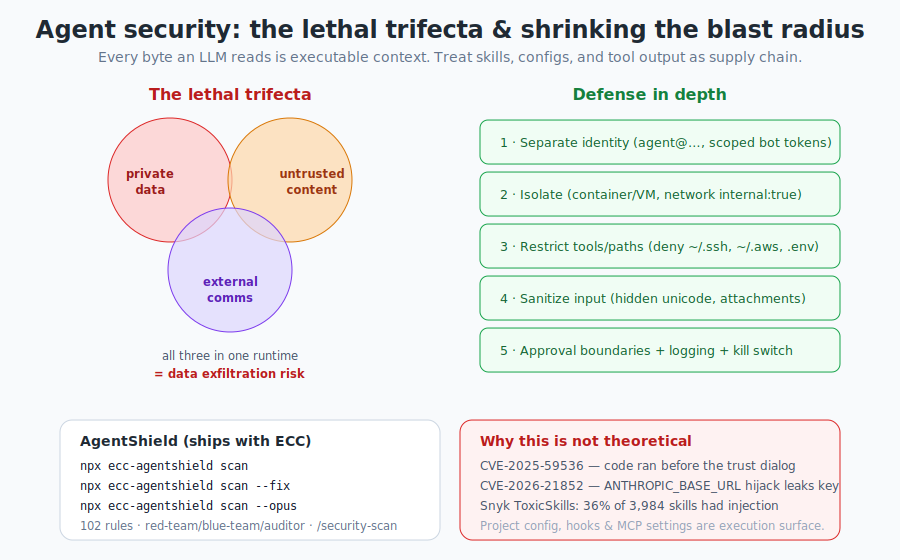

# Chapter 15 — Security

[← Token Optimization](14-token-optimization.md) · [Table of Contents](../README.md) · [Next: ECC 2.0 & the CLI →](16-ecc2-and-cli.md)

---

> Read this chapter **before** you enable hooks that run shell commands, connect MCP servers, or let an agent loop autonomously. ECC ships a whole `the-security-guide.md` for a reason: agentic tooling has become a real attack surface.

## 15.1 Why this is not paranoia

The security guide opens with a sobering point: the tooling we trust is also the tooling being **targeted**. Continuous-run harnesses (Claude Code, Codex, OpenClaw) increase the surface area, and prompt injection in an agentic system is no longer a funny jailbreak screenshot — it can become **shell execution, secret exposure, workflow abuse, or quiet lateral movement**.

<p align="center">
  
</p>

A few numbers from the guide to anchor the stakes (snapshot; details in the repo):

| Stat | Detail |
|------|--------|
| CVSS **8.7** | Claude Code pre-trust execution issue, CVE-2025-59536 |
| **31 companies / 14 industries** | Microsoft's AI memory-poisoning writeup |
| **36% of 3,984** | Public skills with prompt injection in Snyk's ToxicSkills study |
| **1,467** | Malicious payloads Snyk identified |
| **17,470** | Exposed OpenClaw-family instances Hunt.io reported |

The exact counts will change; the *direction of travel* is what matters.

---

## 15.2 The lethal trifecta

The cleanest mental model (from Simon Willison, cited in the guide): three ingredients, dangerous **only when combined in the same runtime**:

1. **Private data** — your secrets, repos, credentials.
2. **Untrusted content** — a PR comment, an email attachment, a fetched web page, an MCP tool's output.
3. **External communication** — the ability to send data out.

Any one or two is usually fine. **All three together** is when prompt injection becomes data exfiltration. Every byte the model reads is executable context — there is no firm line between "data" and "instructions" once text enters the window.

### Attack vectors you actually face
- **Email/PDF attachments** with embedded instructions (your agent reads it as part of a task).
- **GitHub PRs/issues** with hidden diff comments or malicious linked docs — dangerous because automated review bots propagate the exploit downstream.
- **MCP servers** that are vulnerable, malicious, or simply over-trusted (OWASP now has an MCP Top 10: tool poisoning, contextual-payload injection, command injection, shadow servers, secret exposure).
- **Memory poisoning** — a payload that gets *remembered* and resurfaces later.
- **Skills as supply chain** — a third of public skills carried injection in one study. Treat imported skills like any dependency.

---

## 15.3 Real CVEs (Feb 2026)

Check Point Research disclosed Claude Code issues that ended the "this is overblown" phase:

- **CVE-2025-59536** — project-contained code could run **before** the trust dialog was accepted (fixed before `1.0.111`).
- **CVE-2026-21852** — a malicious project could override **`ANTHROPIC_BASE_URL`**, redirect API traffic, and leak the API key before trust confirmation (manual updaters: be on `2.0.65`+).
- **MCP consent abuse** — repo-controlled MCP settings could auto-approve project MCP servers before the directory was meaningfully trusted.

The lesson ECC draws: **project config, hooks, MCP settings, and environment variables are part of the execution surface.** `.claude/` and `.mcp.json` are shared via source control and guarded by a trust boundary — which is exactly what attackers target. (This is also why you should be cautious cloning-and-opening untrusted repos.)

---

## 15.4 Defense in depth (the practical playbook)

The guide is refreshingly concrete. Five layers, easiest-ROI first:

### 1. Separate the identity
Don't give the agent *your* accounts. Create `agent@yourdomain.com`, a separate bot user, a short-lived scoped token. *If your agent has the same accounts you do, a compromised agent is you.*

### 2. Isolate untrusted work
Run untrusted repos / attachment-heavy / foreign-content work in a container, VM, or devcontainer. Default to **no network egress**:
```yaml
services:
  agent:
    build: .
    user: "1000:1000"
    working_dir: /workspace
    volumes: ["./workspace:/workspace:rw"]
    cap_drop: ["ALL"]
    security_opt: ["no-new-privileges:true"]
    networks: ["agent-internal"]
networks:
  agent-internal:
    internal: true        # compromised agent can't phone home
```
For one-off review, even a plain `--network=none` container beats your host:
```bash
docker run -it --rm -v "$(pwd)":/workspace -w /workspace --network=none node:20 bash
```

### 3. Restrict tools and paths (highest ROI, easiest)
If your harness supports permissions, start with deny rules around obvious sensitive material:
```json
{
  "permissions": {
    "deny": [
      "Read(~/.ssh/**)", "Read(~/.aws/**)", "Read(**/.env*)",
      "Write(~/.ssh/**)", "Write(~/.aws/**)",
      "Bash(curl * | bash)", "Bash(ssh *)", "Bash(scp *)", "Bash(nc *)"
    ]
  }
}
```
Give a workflow only what it needs: read-a-repo-and-test shouldn't read your home directory; a single-repo token shouldn't have org-wide write.

### 4. Sanitize input
Everything the model reads is executable context. Watch for hidden unicode / zero-width / bidi characters, HTML-comment payloads, and instructions embedded in attachments or linked content. Sanitize attachments *before* the model sees them. ECC's **Prompt Defense Baseline** (Chapter 9) is the in-prompt layer of this.

### 5. Approval boundaries, logging, and kill switches
Keep a human in the loop for state-changing actions, **log** tool/MCP calls (ECC's governance-capture and MCP-audit hooks help), and have a **kill switch**. Least agency by default.

---

## 15.5 AgentShield — the bundled scanner

ECC ships **AgentShield**, a security auditor for your agent configuration. Run it with zero install:

```bash
npx ecc-agentshield scan            # quick scan
npx ecc-agentshield scan --fix       # auto-fix safe issues
npx ecc-agentshield scan --opus --stream   # deep three-agent analysis
npx ecc-agentshield init             # generate a secure config from scratch
```

**What it scans:** `CLAUDE.md`, `settings.json`, MCP configs, hooks, agent definitions, and skills across five categories — secrets detection (14 patterns), permission auditing, hook-injection analysis, MCP server risk profiling, and agent-config review.

**The `--opus` flag** runs three Opus agents as a **red-team / blue-team / auditor** pipeline: the attacker finds exploit chains, the defender evaluates protections, the auditor synthesizes a prioritized risk assessment. That's adversarial reasoning, not just pattern matching.

**Output:** terminal (A–F grade), JSON (CI), Markdown, HTML. **Exit code 2 on critical findings** so you can gate builds. Inside the harness, run it as `/security-scan`; in CI, use the GitHub Action. AgentShield was built at the Claude Code Hackathon (Cerebral Valley × Anthropic) and reports 1282 tests, ~98% coverage, 102 static-analysis rules.

---

## 15.6 The minimum bar checklist

Before you let ECC (or any agent harness) run with real permissions:

- [ ] Agent uses a **separate identity** (not your personal accounts).
- [ ] Untrusted work runs in an **isolated** container/VM with **no default egress**.
- [ ] **Deny rules** protect `~/.ssh`, `~/.aws`, `.env`, and dangerous bash (`curl | bash`, `ssh`, `scp`, `nc`).
- [ ] Tools are **scoped** to what each workflow needs; tokens are short-lived and least-privilege.
- [ ] Inputs are **sanitized**; the Prompt Defense Baseline is present.
- [ ] State-changing actions need **approval**; tool/MCP calls are **logged**; you have a **kill switch**.
- [ ] You ran **`npx ecc-agentshield scan`** (and fixed criticals).
- [ ] **< 10 MCPs / < 80 tools** enabled; you trust each one.
- [ ] You **don't clone-and-open untrusted repos** on your host machine.

---

## 15.7 ECC's built-in security posture

ECC isn't just *advice* about security — it bakes a lot in:
- **Prompt Defense Baseline** in every agent and in `CLAUDE.md`.
- **Security-First** as a core principle; mandatory pre-commit checks (no hardcoded secrets, input validation, SQLi/XSS/CSRF prevention, auth checks, rate limiting, no sensitive data in logs).
- A **`security-reviewer`** agent and `security-review` skill (OWASP-aligned).
- **Hooks** for secret detection, config protection, governance capture, and MCP health.
- A supply-chain IOC scan (`npm run security:ioc-scan`) and advisory sources tooling.

---

## 15.8 Key takeaways

- The **lethal trifecta** (private data + untrusted content + external comms) is when injection becomes exfiltration.
- Project config, hooks, MCP settings, and env vars are **execution surface** — real CVEs (59536, 21852) prove it.
- Defend in depth: **separate identity → isolate → restrict tools/paths → sanitize → approve/log/kill**.
- Run **`npx ecc-agentshield scan`** (or `/security-scan`); use `--opus` for adversarial analysis; gate CI on exit code 2.
- Treat **skills and MCP servers as supply chain**. Don't clone-and-open untrusted repos on your host.

Next: the operator layer above individual installs — ECC 2.0 and the CLI.

---

[← Token Optimization](14-token-optimization.md) · [Table of Contents](../README.md) · [Next: ECC 2.0 & the CLI →](16-ecc2-and-cli.md)
