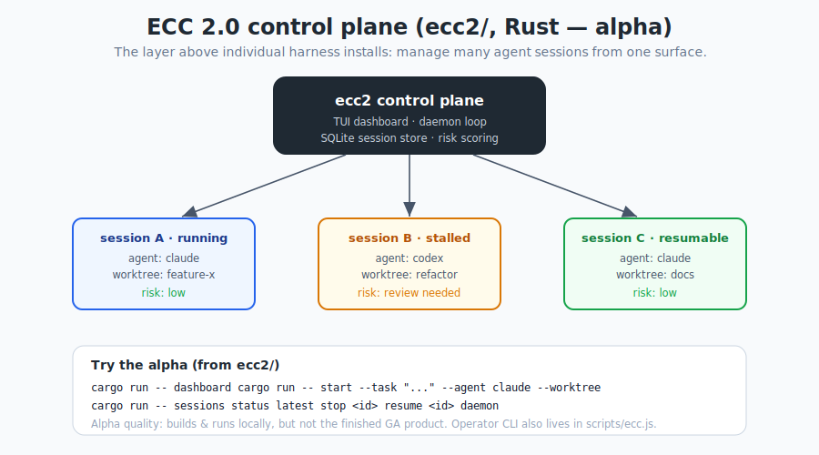

# 第 16 章 —— ECC 2.0 與操作者 CLI

[← 安全](15-security_hk.md) · [目錄](../README_hk.md) · [下一章：儀表板與工具 →](17-dashboard-and-tooling_hk.md)

---

到目前為止,我哋一直將 ECC 當作一個*你安裝入一個框架嘅目錄*。ECC 2.0 引入咗一個喺嗰個之**上**嘅層次：一個從單一介面操作**多個代理會話**嘅方式。呢一章講 Rust 控制平面原型（`ecc2/`），以及你今日就用得到嘅 `ecc` 操作者 CLI。

## 16.1 動機

一旦你運行緊幾個代理——唔同 worktree、唔同框架、有啲喺度自主迴圈——你就需要操作者問題嘅答案：*邊啲會話運行緊？邊啲停滯咗？邊啲需要審查？風險係乜？我喺邊度停低咗？* 嗰個就係**控制平面**嘅工作。

<p align="center">
  
</p>

> ECC 2.0 係凌駕個別框架安裝之上嘅層次：管理多個代理會話、保持狀態／輸出／風險可見、加入編排同審查控制——以 Claude Code 為先,同時唔阻礙未來框架嘅互通性。

---

## 16.2 `ecc2/` —— Rust 控制平面（alpha）

`ecc2/` 係目前以 Rust 為基礎嘅 ECC 2.0 鷹架。repo **對佢嘅狀態好誠實**,你都應該咁：

- 佢係**真實程式碼**、**alpha 品質**,可以喺本地有效咁 build 同 test。
- 佢**唔係**完成品嘅 ECC 2.0 產品。repo 甚至有一條規則：*唔好淨係因為鷹架 build 得到,就將 `ecc2/` 當作已完成嚟宣傳。*

### 今日存在咩
- 一個**終端 UI 儀表板**。
- 一個**由 SQLite 支撐嘅會話儲存**。
- 會話**啟動／停止／恢復**流程。
- 一個**背景 daemon** 模式。
- **可觀測性同風險評分**原語（primitives）。
- **感知 worktree** 嘅會話鷹架。
- 基本嘅**多會話狀態同輸出追蹤**。

### 仲欠咩
更豐富嘅多代理編排、明確嘅代理對代理委派／摘要、一個視覺化嘅 worktree/diff 審查介面、更強嘅外部框架相容性、更深入嘅感知記憶／路線圖嘅規劃,以及一個發佈／安裝器嘅故事。

### 試用 alpha
由 repo 根目錄：
```bash
cd ecc2
cargo run -- dashboard                       # 啟動 TUI 儀表板
cargo run -- start --task "audit the repo and propose fixes" --agent claude --worktree
cargo run -- sessions                        # 列出會話
cargo run -- status latest                   # 檢視一個會話
cargo run -- stop <session-id>               # 停止
cargo run -- resume <session-id>             # 恢復一個已停止／失敗的會話
cargo run -- daemon                          # 運行 daemon 迴圈
cargo test                                   # 驗證
```

將佢諗成 ECC 去向嘅一個預覽：由「一個助手嘅設定」去到「一隊代理嘅操作主控台」。

---

## 16.3 `ecc` 操作者 CLI（今日就用）

你唔需要 Rust alpha 都得到操作者功能——以 Node 為基礎嘅 `ecc` CLI（`scripts/ecc.js`）穩定,並隨套件附帶。佢嘅 bins（來自 `package.json`）：

| Bin | 腳本 | 角色 |
|-----|--------|------|
| `ecc` | `scripts/ecc.js` | 主要操作者／生命週期 CLI |
| `ecc-install` | `scripts/install-apply.js` | 選擇性安裝套用器 |
| `ecc-control-pane` | `scripts/control-pane.js` | 控制平面基底 |

### 生命週期與健康（第 3 章回顧）
```bash
node scripts/ecc.js list-installed     # ECC 安裝咗咩
node scripts/ecc.js doctor             # 診斷問題
node scripts/ecc.js repair             # 還原 ECC 管理的檔案
node scripts/ecc.js uninstall --dry-run
```

### 發現與安裝
```bash
npx ecc consult "security reviews" --target claude     # 搵相符的組件
npx ecc install --profile minimal --target claude --with capability:machine-learning
```

### 操作者狀態快照
一個對團隊同交接真正有用嘅功能——將本地狀態變成一份可攜嘅 Markdown 報告：
```bash
npx ecc status --markdown --write status.md
```
佢涵蓋就緒度、活躍會話、技能運行健康、安裝健康、待定治理事件,以及連結嘅工作項目。相關指令：
```bash
npx ecc work-items upsert ...                       # 手動工作項目條目
npx ecc work-items sync-github --repo owner/repo     # 拉取 PR/issue 佇列狀態
npx ecc status --exit-code                           # 當就緒度需要關注時令自動化失敗
```

---

## 16.4 編排與自主迴圈

ECC 包含運行同監督代理迴圈同並行工作嘅工具：

- **`/loop-start`、`/loop-status`** —— 啟動同檢視受控嘅代理式迴圈;`loop-operator` 代理監察停滯並介入。
- **`/claw`** —— NanoClaw v2,一個持久化 REPL,帶模型路由、技能熱載入、會話分支／搜尋／匯出／壓縮／指標。
- **`autonomous-loops` 技能** —— 用於順序流水線、PR 迴圈同 DAG 編排嘅模式（帶防止失控觀察者迴圈嘅護欄）。
- **`scripts/orchestrate-worktrees.js`** / `npm run orchestrate:tmux` —— tmux + worktree 多代理編排。
- **`/harness-audit`**（`npm run harness:audit`）—— 就可靠性、評估就緒度同風險為你嘅框架設定評分;`harness-optimizer` 代理調校佢。

呢啲嘢強大但有少少危險——喺自主運行任何嘢之前,重讀第 15 章。

---

## 16.5 值得認識的 npm 腳本

`package.json` 暴露咗操作者／CI 腳本。樣本如下：

```bash
npm test                      # 完整驗證：unicode 安全、agent/command/rule/skill/hook
                              # 驗證器、catalog + command-registry 檢查，然後 tests/run-all.js
npm run dashboard             # 啟動桌面 GUI（第 17 章）
npm run harness:audit         # 框架可靠性／風險評分
npm run observability:ready   # 可觀測性就緒度檢查
npm run operator:dashboard    # 操作者就緒度儀表板
npm run control:pane          # 控制平面基底
npm run security:ioc-scan     # 供應鏈 IOC 掃描
npm run claw                  # NanoClaw v2
npm run orchestrate:status    # 編排狀態
```

---

## 16.6 重點摘要

- ECC 2.0 係**凌駕個別安裝之上嘅操作者層次**——管理多個會話、睇狀態／風險、編排。
- **`ecc2/`**（Rust）係一個真實但 **alpha** 嘅控制平面：`cargo run -- dashboard|start|sessions|status|stop|resume|daemon`。
- **`ecc` CLI** 今日就穩定：`consult`、`install`、`doctor`、`repair`、`list-installed`、`uninstall`,同 `status --markdown`。
- 編排工具（`/loop-start`、`/claw`、worktree 編排、`/harness-audit`）已存在——小心使用。

下一章：友善嘅大門——桌面儀表板同生態系工具。

---

[← 安全](15-security_hk.md) · [目錄](../README_hk.md) · [下一章：儀表板與工具 →](17-dashboard-and-tooling_hk.md)
